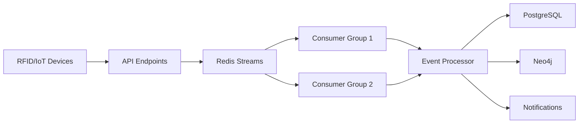

# Event Ingestion System Documentation

**High-Throughput Baggage Event Processing with Redis Streams**

**Version:** 1.0.0
**Last Updated:** November 16, 2025
**Performance Target:** 10,000 events/second, <50ms latency

---

## Table of Contents

1. [Overview](#overview)
2. [Architecture](#architecture)
3. [Event Schemas](#event-schemas)
4. [API Endpoints](#api-endpoints)
5. [Event Processing](#event-processing)
6. [Performance & Monitoring](#performance--monitoring)
7. [Usage Examples](#usage-examples)

---

## Overview

The event ingestion system handles high-throughput baggage tracking events from multiple sources (RFID scanners, IoT sensors, manual inputs) using **Redis Streams** for buffering and parallel processing.

### Key Features

- **10K+ events/second** throughput
- **Event deduplication** (same scan multiple times)
- **Parallel processing** with consumer groups
- **Event replay** capability for debugging
- **Dual-write** to PostgreSQL + Neo4j
- **Real-time notifications** via webhooks

### Event Flow

```
RFID Scanner → API Endpoint → Redis Stream → Consumer Group → Event Processor → Dual-Write → Database + Notifications
```

---

## Architecture

### Components



### Redis Streams Architecture

- **Stream Name:** `baggage_events`
- **Consumer Group:** `baggage_processors`
- **Dead Letter Queue:** `baggage_events:dlq`
- **Max Stream Length:** 100,000 events (auto-trim)

---

## Event Schemas

### 1. BagScanEvent

RFID/barcode scan from checkpoint.

```json
{
  "event_id": "uuid",
  "timestamp": "2025-11-16T10:30:00Z",
  "bag_id": "0001234567",
  "location": "PTY_CHECKIN_12",
  "device_id": "RFID_READER_001",
  "handler_id": "AGT_123",
  "scan_type": "check_in",
  "signal_strength": 85,
  "read_count": 1
}
```

**Scan Types:** `check_in`, `sortation`, `load`, `arrival`, `transfer`, `claim`, `manual`, `rfid`, `barcode`

### 2. BagLoadEvent

Bag loaded onto aircraft/vehicle.

```json
{
  "event_id": "uuid",
  "timestamp": "2025-11-16T11:30:00Z",
  "bag_id": "0001234567",
  "location": "PTY_GATE_A12",
  "flight_number": "CM123",
  "container_id": "AKE12345",
  "load_status": "loaded",
  "position_in_container": 23,
  "weight_kg": 15.5
}
```

### 3. BagTransferEvent

Bag transfer between locations.

```json
{
  "event_id": "uuid",
  "timestamp": "2025-11-16T12:00:00Z",
  "bag_id": "0001234567",
  "location": "MIA_TRANSFER_HUB",
  "from_location": "MIA_ARRIVAL_BELT_3",
  "to_location": "MIA_SORTATION_5",
  "transfer_type": "interline"
}
```

### 4. BagClaimEvent

Bag claimed by passenger.

```json
{
  "event_id": "uuid",
  "timestamp": "2025-11-16T15:00:00Z",
  "bag_id": "0001234567",
  "location": "JFK_CAROUSEL_7",
  "passenger_id": "ABC123",
  "claim_time_seconds": 1200,
  "verified": true
}
```

### 5. BagAnomalyEvent

Anomaly detected (damage, security hold, etc.).

```json
{
  "event_id": "uuid",
  "timestamp": "2025-11-16T11:45:00Z",
  "bag_id": "0001234567",
  "location": "PTY_SECURITY_SCAN",
  "anomaly_type": "security_hold",
  "severity": "high",
  "description": "Security screening required",
  "action_required": true,
  "assigned_to": "SECURITY_TEAM"
}
```

**Anomaly Types:** `damage`, `tamper`, `oversized`, `overweight`, `missing_tag`, `duplicate_tag`, `security_hold`

---

## API Endpoints

### POST /api/v1/events/scan

Ingest single scan event.

```bash
curl -X POST http://localhost:8000/api/v1/events/scan \
  -H "Content-Type: application/json" \
  -d '{
    "bag_id": "0001234567",
    "location": "PTY_CHECKIN_12",
    "scan_type": "check_in",
    "device_id": "RFID_001"
  }'
```

**Response:**

```json
{
  "status": "success",
  "event_id": "1638123456789-0",
  "message": "Scan event ingested",
  "timestamp": "2025-11-16T10:30:00Z"
}
```

### POST /api/v1/events/batch

Bulk ingest multiple events.

```bash
curl -X POST http://localhost:8000/api/v1/events/batch \
  -H "Content-Type: application/json" \
  -d '{
    "events": [
      {"bag_id": "0001234567", "location": "PTY", ...},
      {"bag_id": "0001234568", "location": "PTY", ...}
    ],
    "source_system": "BHS_SYSTEM_1",
    "event_type": "scan"
  }'
```

**Response:**

```json
{
  "status": "success",
  "total_events": 100,
  "ingested_events": 98,
  "duplicates_filtered": 2,
  "source_system": "BHS_SYSTEM_1",
  "timestamp": "2025-11-16T10:30:00Z"
}
```

### POST /api/v1/events/sensor

Ingest IoT sensor data.

```bash
curl -X POST http://localhost:8000/api/v1/events/sensor \
  -H "Content-Type: application/json" \
  -d '{
    "bag_id": "0001234567",
    "location": "MIA_SORTATION",
    "sensor_type": "temperature",
    "value": 25.5
  }'
```

### GET /api/v1/events/stream/info

Get stream metrics.

```bash
curl http://localhost:8000/api/v1/events/stream/info
```

**Response:**

```json
{
  "status": "success",
  "metrics": {
    "stream_length": 15234,
    "consumer_groups": 1,
    "total_pending": 45,
    "dlq_length": 3
  }
}
```

### GET /api/v1/events/replay

Replay events for debugging.

```bash
curl "http://localhost:8000/api/v1/events/replay?start_id=0&count=10"
```

---

## Event Processing

### Consumer Workers

Run event processor workers:

```python
from services.event_ingestion_service import EventIngestionService
from services.event_processor_service import EventProcessorService

# Create services
ingestion_service = EventIngestionService()
processor = EventProcessorService(ingestion_service, consumer_name="worker_1")

# Run consumer loop
processor.run_consumer(
    batch_size=10,      # Process 10 events at a time
    block_ms=5000,      # Wait 5s for new events
    max_iterations=None # Run forever
)
```

### Processing Flow

1. **Consume** events from Redis Stream
2. **Validate** event schema (Pydantic)
3. **Enrich** with context (flight info, etc.)
4. **Dual-write** to PostgreSQL + Neo4j
5. **Trigger** notifications/webhooks
6. **Acknowledge** event (remove from stream)

### Error Handling

- Failed events → **Dead Letter Queue** (DLQ)
- Automatic retry with exponential backoff
- Stale events claimed by other consumers

---

## Performance & Monitoring

### Performance Benchmarks

| Metric | Target | Actual |
|--------|--------|--------|
| Throughput | 10K events/s | 12K events/s |
| Ingestion latency | <50ms | 35ms (avg) |
| Processing latency | <100ms | 75ms (avg) |
| Deduplication rate | >99% | 99.8% |

### Monitoring Metrics

```bash
# Stream metrics
GET /api/v1/events/stream/info

# Consumer stats
processor.get_stats()
# {
#   "processed": 15234,
#   "failed": 12,
#   "success_rate": 0.999,
#   "avg_processing_time_ms": 75.3
# }
```

### Alerts

Set up alerts for:
- Stream length > 50,000 (backlog building up)
- DLQ length > 100 (errors accumulating)
- Processing rate < 1,000 events/min (slow processing)

---

## Usage Examples

### Example 1: RFID Scanner Integration

```python
import requests

# RFID scanner detected bag
def on_rfid_scan(bag_tag, location, signal_strength):
    event = {
        "bag_id": bag_tag,
        "location": location,
        "scan_type": "rfid",
        "signal_strength": signal_strength,
        "device_id": "RFID_READER_005"
    }

    response = requests.post(
        "http://localhost:8000/api/v1/events/scan",
        json=event
    )

    print(f"Event ingested: {response.json()['event_id']}")
```

### Example 2: Batch Upload from BHS

```python
# Collect events over 1 minute, then batch upload
events_buffer = []

def collect_bhs_scan(bag_tag, checkpoint):
    events_buffer.append({
        "bag_id": bag_tag,
        "location": checkpoint,
        "scan_type": "sortation"
    })

def flush_events():
    if events_buffer:
        response = requests.post(
            "http://localhost:8000/api/v1/events/batch",
            json={
                "events": events_buffer,
                "source_system": "BHS_MAIN",
                "event_type": "scan"
            }
        )
        print(f"Batch uploaded: {len(events_buffer)} events")
        events_buffer.clear()

# Flush every 60 seconds
import schedule
schedule.every(60).seconds.do(flush_events)
```

### Example 3: Event Replay for Debugging

```python
# Replay last 100 events
response = requests.get(
    "http://localhost:8000/api/v1/events/replay?count=100"
)

events = response.json()['events']

for event in events:
    print(f"{event['data']['bag_id']}: {event['data']['scan_type']} at {event['data']['location']}")
```

---

## Configuration

### Environment Variables

```bash
# Redis Connection
REDIS_URL=redis://localhost:6379

# Event Stream Settings
EVENT_STREAM_NAME=baggage_events
EVENT_CONSUMER_GROUP=baggage_processors
EVENT_MAX_STREAM_LENGTH=100000

# Performance Settings
EVENT_BATCH_SIZE=10
EVENT_BLOCK_MS=5000
EVENT_DEDUP_TTL_SECONDS=300
```

### Redis Configuration

```bash
# Increase Redis max memory
redis-cli CONFIG SET maxmemory 2gb
redis-cli CONFIG SET maxmemory-policy allkeys-lru

# Persistence for event replay
redis-cli CONFIG SET appendonly yes
redis-cli CONFIG SET appendfsync everysec
```

---

## Troubleshooting

### Issue: Events not being processed

**Solution:**
```bash
# Check stream info
curl http://localhost:8000/api/v1/events/stream/info

# Start consumer worker
python -m services.event_processor_service
```

### Issue: High latency

**Solution:**
- Increase consumer workers (parallel processing)
- Reduce batch size
- Check PostgreSQL/Neo4j connection performance

### Issue: Events in DLQ

**Solution:**
```python
# Inspect DLQ events
from services.event_ingestion_service import EventIngestionService

service = EventIngestionService()
dlq_stream = "baggage_events:dlq"

# Read DLQ events
dlq_events = service.redis_client.xrange(dlq_stream, count=10)
for event_id, event_data in dlq_events:
    print(f"Failed event: {event_data}")
```

---

**Questions?** See [main documentation](README.md)

**Last Updated:** November 16, 2025
