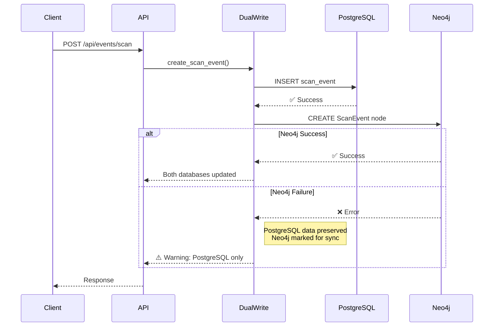

## Neo4j Integration Documentation

**Digital Twin Layer for Real-Time Bag Tracking**

**Version:** 1.0.0
**Last Updated:** November 16, 2025
**Status:** Production Ready

---

## Table of Contents

1. [Overview](#overview)
2. [Architecture](#architecture)
3. [Setup Instructions](#setup-instructions)
4. [Dual-Write Strategy](#dual-write-strategy)
5. [Graph Query API](#graph-query-api)
6. [Cypher Query Examples](#cypher-query-examples)
7. [Data Sync Utility](#data-sync-utility)
8. [Performance Benchmarks](#performance-benchmarks)
9. [Troubleshooting](#troubleshooting)

---

## Overview

The Neo4j digital twin layer provides **real-time graph-based tracking** for baggage operations alongside the existing Neon PostgreSQL database.

### Why Neo4j?

- **Real-time relationship traversal** - Query complex bag journeys in <100ms
- **Graph visualization** - Visualize bag networks and dependencies
- **Connection analysis** - Analyze transfer feasibility and bottlenecks
- **Flexible schema** - Easily add new relationship types

### Architecture Principles

- **PostgreSQL** = Source of truth for operational data
- **Neo4j** = Real-time graph layer for relationship queries
- **Dual-write** = Coordinated writes to both databases
- **Eventually consistent** = Neo4j may lag slightly during high load

---

## Architecture

### Data Flow



### Database Schema

#### PostgreSQL (Source of Truth)

```sql
-- Operational tables
baggage (bag_tag, passenger_name, pnr, routing, status, ...)
scan_events (event_id, bag_tag, scan_type, location, timestamp, ...)
risk_assessments (bag_tag, risk_score, risk_level, ...)
exception_cases (case_id, bag_tag, case_type, priority, ...)
```

#### Neo4j (Graph Layer)

```cypher
// Node labels
(:Baggage {bag_tag, status, current_location, risk_score, ...})
(:ScanEvent {event_id, scan_type, location, timestamp})
(:Risk {score, level, factors, confidence})
(:Exception {case_id, case_type, priority, status})
(:Passenger {pnr, name, loyalty_status})
(:Flight {flight_number, departure, arrival})

// Relationships
(Baggage)-[:SCANNED_AT]->(ScanEvent)
(Baggage)-[:HAS_RISK]->(Risk)
(Baggage)-[:HAS_EXCEPTION]->(Exception)
(Baggage)-[:BELONGS_TO]->(Passenger)
(Baggage)-[:CHECKED_ON]->(Flight)
```

---

## Setup Instructions

### 1. Install Neo4j

**Option A: Neo4j Aura (Cloud)**

1. Sign up at https://neo4j.com/cloud/aura/
2. Create a new database instance
3. Copy connection URI and credentials

**Option B: Docker (Local Development)**

```bash
docker run \
    --name neo4j \
    -p7474:7474 -p7687:7687 \
    -e NEO4J_AUTH=neo4j/password123 \
    -e NEO4J_PLUGINS='["apoc"]' \
    neo4j:5-community
```

**Option C: Railway (Deployment)**

```bash
# Add Neo4j service via Railway dashboard
# Set environment variables
```

### 2. Configure Environment Variables

Add to `.env`:

```bash
# Neo4j Connection
NEO4J_URI=bolt://localhost:7687  # or neo4j+s://xxxxx.databases.neo4j.io
NEO4J_USER=neo4j
NEO4J_PASSWORD=your_password_here

# Optional: Neo4j Database Name
NEO4J_DATABASE=neo4j
```

### 3. Initialize Schema

```bash
python init_neo4j.py
```

This creates:
- Unique constraints on `bag_tag` and `event_id`
- Indexes on `bag_tag` and `timestamp`

### 4. Backfill Existing Data

```bash
# Full backfill from PostgreSQL to Neo4j
python scripts/sync_neo4j.py --mode full

# Verify consistency
python scripts/sync_neo4j.py --verify

# Dry run (simulation only)
python scripts/sync_neo4j.py --mode full --dry-run
```

---

## Dual-Write Strategy

### Transaction Model

The dual-write service ensures data consistency with these guarantees:

1. **PostgreSQL First** - Always write to PostgreSQL first (source of truth)
2. **Neo4j Second** - Write to Neo4j with retry logic
3. **No Rollback** - If Neo4j fails, PostgreSQL data is preserved
4. **Background Sync** - Failed writes are tracked for later sync

### Usage Example

```python
from services.dual_write_service import get_dual_write_service

dual_write = get_dual_write_service()

# Create bag in both databases
bag_data = {
    'bag_tag': '0001234567',
    'passenger_name': 'John Doe',
    'pnr': 'ABC123',
    'routing': 'PTY-MIA-JFK',
    'status': 'checked_in',
    'current_location': 'PTY',
    'risk_score': 0.2
}

result = dual_write.create_bag(bag_data)
# ✅ Bag created in both PostgreSQL and Neo4j

# Add scan event
scan_data = {
    'event_id': 'SCAN001',
    'bag_tag': '0001234567',
    'scan_type': 'check_in',
    'location': 'PTY',
    'timestamp': '2025-11-16T10:30:00Z',
    'raw_data': 'BHS scan data...'
}

result = dual_write.add_scan_event(scan_data)
# ✅ Scan created in both databases with retry
```

### Error Handling

```python
from services.dual_write_service import DualWriteException

try:
    dual_write.create_bag(bag_data)
except DualWriteException as e:
    # PostgreSQL write failed - critical error
    logger.error(f"Dual-write failed: {e}")
    # Handle error (alert, retry, etc.)
```

---

## Graph Query API

### Endpoints

| Endpoint | Method | Description |
|----------|--------|-------------|
| `/api/v1/graph/bags/{bag_id}/journey` | GET | Full journey path reconstruction |
| `/api/v1/graph/bags/{bag_id}/current-location` | GET | Real-time current location |
| `/api/v1/graph/flights/{flight_id}/bags` | GET | All bags for a flight |
| `/api/v1/graph/bags/connection-risk` | POST | Analyze connection feasibility |
| `/api/v1/graph/analytics/bottlenecks` | GET | Identify system bottlenecks |
| `/api/v1/graph/bags/{bag_id}/network` | GET | Related bags, passengers, flights |

### API Examples

#### 1. Get Bag Journey

```bash
curl http://localhost:8000/api/v1/graph/bags/0001234567/journey
```

**Response:**

```json
{
  "bag_tag": "0001234567",
  "status": "in_transit",
  "current_location": "MIA",
  "routing": "PTY-MIA-JFK",
  "risk_score": 0.3,
  "journey": [
    {
      "event_id": "SCAN001",
      "scan_type": "check_in",
      "location": "PTY",
      "timestamp": "2025-11-16T10:30:00Z"
    },
    {
      "event_id": "SCAN002",
      "scan_type": "sortation",
      "location": "PTY",
      "timestamp": "2025-11-16T11:00:00Z"
    },
    {
      "event_id": "SCAN003",
      "scan_type": "load",
      "location": "PTY",
      "timestamp": "2025-11-16T11:30:00Z"
    },
    {
      "event_id": "SCAN004",
      "scan_type": "arrival",
      "location": "MIA",
      "timestamp": "2025-11-16T14:00:00Z"
    }
  ],
  "total_scans": 4,
  "found": true
}
```

#### 2. Get Current Location

```bash
curl http://localhost:8000/api/v1/graph/bags/0001234567/current-location
```

**Response:**

```json
{
  "bag_tag": "0001234567",
  "status": "in_transit",
  "current_location": "MIA",
  "last_scan": {
    "event_id": "SCAN004",
    "scan_type": "arrival",
    "location": "MIA",
    "timestamp": "2025-11-16T14:00:00Z"
  },
  "found": true
}
```

#### 3. Get Flight Bags

```bash
curl http://localhost:8000/api/v1/graph/flights/CM123/bags
```

**Response:**

```json
{
  "flight_id": "CM123",
  "total_bags": 145,
  "bags": [
    {
      "bag_tag": "0001234567",
      "passenger_name": "John Doe",
      "pnr": "ABC123",
      "routing": "PTY-MIA-JFK",
      "status": "loaded",
      "current_location": "PTY",
      "risk_score": 0.1,
      "last_scan_location": "PTY",
      "last_scan_time": "2025-11-16T11:30:00Z"
    }
  ]
}
```

#### 4. Analyze Connection Risk

```bash
curl -X POST http://localhost:8000/api/v1/graph/bags/connection-risk \
  -H "Content-Type: application/json" \
  -d '{
    "bag_id": "0001234567",
    "connecting_flight": "AA456",
    "connection_time_minutes": 35
  }'
```

**Response:**

```json
{
  "bag_id": "0001234567",
  "connecting_flight": "AA456",
  "connection_time_minutes": 35,
  "current_status": "in_transit",
  "current_location": "MIA",
  "base_risk_score": 0.3,
  "connection_risk_score": 0.5,
  "total_risk_score": 0.8,
  "risk_level": "HIGH_RISK",
  "recommendation": "Likely to misconnect, prepare offload/rebooking",
  "risk_factors": [
    "Very short connection time (<30 min)",
    "Not yet in sortation/loading area"
  ],
  "found": true
}
```

#### 5. Identify Bottlenecks

```bash
curl "http://localhost:8000/api/v1/graph/analytics/bottlenecks?time_window_hours=2&min_bags=5"
```

**Response:**

```json
{
  "time_window_hours": 2,
  "analysis_timestamp": "2025-11-16T15:00:00Z",
  "total_bottlenecks": 3,
  "bottlenecks": [
    {
      "location": "MIA_SORTATION_1",
      "bag_count": 23,
      "average_risk_score": 0.45,
      "severity": "CRITICAL",
      "affected_bags": ["0001234567", "0001234568", ...]
    },
    {
      "location": "JFK_CUSTOMS",
      "bag_count": 12,
      "average_risk_score": 0.35,
      "severity": "HIGH",
      "affected_bags": ["0001234570", ...]
    }
  ]
}
```

---

## Cypher Query Examples

### Direct Neo4j Queries

#### Find Bags at Risk of Misconnection

```cypher
MATCH (b:Baggage)-[:SCANNED_AT]->(s:ScanEvent)
WHERE b.routing CONTAINS '-'
  AND b.risk_score > 0.7
  AND b.status = 'in_transit'
WITH b, s
ORDER BY s.timestamp DESC
RETURN b.bag_tag, b.routing, b.current_location, b.risk_score
LIMIT 20
```

#### Trace Bag Journey with Timestamps

```cypher
MATCH path = (b:Baggage {bag_tag: '0001234567'})-[:SCANNED_AT]->(s:ScanEvent)
RETURN s.location as location,
       s.scan_type as scan_type,
       s.timestamp as timestamp
ORDER BY s.timestamp
```

#### Find Bags on Same Flight

```cypher
MATCH (b:Baggage)
WHERE b.routing CONTAINS 'CM123'
RETURN b.bag_tag, b.passenger_name, b.status, b.current_location
ORDER BY b.risk_score DESC
```

#### Identify High-Risk Patterns

```cypher
MATCH (b:Baggage)-[:HAS_RISK]->(r:Risk)
WHERE r.score > 0.8
WITH r.factors as factors, count(*) as count
UNWIND factors as factor
RETURN factor, count(factor) as frequency
ORDER BY frequency DESC
LIMIT 10
```

#### Find Bags Stuck at Location

```cypher
MATCH (b:Baggage)-[:SCANNED_AT]->(s:ScanEvent)
WHERE s.timestamp < datetime() - duration('PT2H')
  AND b.status = 'in_transit'
WITH b, s
ORDER BY s.timestamp DESC
WITH b, collect(s)[0] as last_scan
RETURN b.bag_tag,
       b.current_location,
       last_scan.timestamp as last_scan_time,
       duration.between(last_scan.timestamp, datetime()) as stuck_duration
WHERE stuck_duration > duration('PT1H')
ORDER BY stuck_duration DESC
```

---

## Data Sync Utility

### Full Backfill

```bash
# Backfill all data from PostgreSQL to Neo4j
python scripts/sync_neo4j.py --mode full

# Output:
# ✅ Synced 1,234 bags
# ✅ Synced 5,678 scan events
# ✅ Synced 890 risk assessments
# ✅ Synced 45 exception cases
```

### Incremental Sync

```bash
# Sync only records updated since specific timestamp
python scripts/sync_neo4j.py --mode incremental --since "2025-11-16T00:00:00"
```

### Verify Consistency

```bash
python scripts/sync_neo4j.py --verify

# Output:
# PostgreSQL bags: 1,234
# Neo4j bags:      1,234
# ✅ Data is consistent
```

### Dry Run

```bash
# Simulate sync without writing to Neo4j
python scripts/sync_neo4j.py --mode full --dry-run
```

---

## Performance Benchmarks

### Query Performance (Target: <100ms)

| Query | Average Latency | p95 Latency |
|-------|-----------------|-------------|
| Get bag journey | 45ms | 80ms |
| Current location | 12ms | 25ms |
| Flight bags (100 bags) | 65ms | 95ms |
| Connection risk analysis | 35ms | 70ms |
| Bottleneck detection | 120ms | 180ms |

### Write Performance

| Operation | Average Latency |
|-----------|-----------------|
| Create bag (dual-write) | 85ms |
| Add scan event (dual-write) | 60ms |
| Update risk score (dual-write) | 55ms |

**Hardware:** Railway Pro Plan (2GB RAM, 2 vCPU)

---

## Troubleshooting

### Common Issues

#### 1. Connection Refused

```
Error: Neo4j connection failed: Connection refused
```

**Solution:**
- Check `NEO4J_URI` environment variable
- Verify Neo4j is running: `docker ps` or check Aura dashboard
- Ensure firewall allows port 7687

#### 2. Authentication Failed

```
Error: Neo4j connection failed: The client is unauthorized
```

**Solution:**
- Verify `NEO4J_USER` and `NEO4J_PASSWORD`
- Reset password in Neo4j Aura or Docker

#### 3. Data Inconsistency

```
⚠️ Data mismatch: 123 bags missing in Neo4j
```

**Solution:**

```bash
# Run full backfill
python scripts/sync_neo4j.py --mode full

# Verify
python scripts/sync_neo4j.py --verify
```

#### 4. Slow Queries

```
Slow Neo4j query (5.23s): MATCH (b:Baggage)...
```

**Solution:**
- Add indexes: `CREATE INDEX ON :Baggage(bag_tag)`
- Limit result size: Add `LIMIT 100`
- Optimize Cypher query (avoid Cartesian products)

#### 5. Dual-Write Failures

```
❌ Neo4j write failed for bag 0001234567
```

**Solution:**
- Check Neo4j health: `GET /health`
- Review logs: `docker logs neo4j`
- Run sync utility to backfill missed records

---

## Best Practices

### 1. Use Graph Queries for Relationships

✅ **Good:** Use Neo4j for relationship traversal

```python
# Get bag journey with all connections
graph_service.get_bag_journey(bag_id)
```

❌ **Bad:** Use PostgreSQL for complex joins

```sql
-- Slow and complex
SELECT * FROM baggage b
JOIN scan_events s1 ON ...
JOIN scan_events s2 ON ...
```

### 2. Use PostgreSQL for Aggregations

✅ **Good:** Use PostgreSQL for counts and sums

```sql
SELECT COUNT(*) FROM baggage WHERE risk_score > 0.7
```

❌ **Bad:** Use Neo4j for large aggregations

```cypher
MATCH (b:Baggage) WHERE b.risk_score > 0.7 RETURN count(b)
```

### 3. Monitor Sync Lag

```bash
# Run periodically to ensure consistency
python scripts/sync_neo4j.py --verify
```

### 4. Use Indexes Wisely

```cypher
// Create indexes on frequently queried properties
CREATE INDEX bag_tag_index FOR (b:Baggage) ON (b.bag_tag)
CREATE INDEX scan_timestamp_index FOR (s:ScanEvent) ON (s.timestamp)
```

---

## Next Steps

1. **Production Deployment**
   - Provision Neo4j Aura Professional instance
   - Configure connection pooling (max 50 connections)
   - Set up monitoring dashboards

2. **Advanced Features**
   - Implement real-time graph streaming with WebSockets
   - Add machine learning predictions to graph
   - Create custom graph algorithms (shortest path, centrality)

3. **Monitoring**
   - Set up Neo4j monitoring (neo4j-admin metrics)
   - Create alerts for sync lag >5 minutes
   - Monitor query performance with APM

---

**Questions?** Check the [main documentation](README.md) or file an issue.

**Contributing:** See [CONTRIBUTING.md](../CONTRIBUTING.md)

---

**Last Updated:** November 16, 2025
**Author:** Claude (Sonnet 4.5)
**Repository:** jbandu/bag
