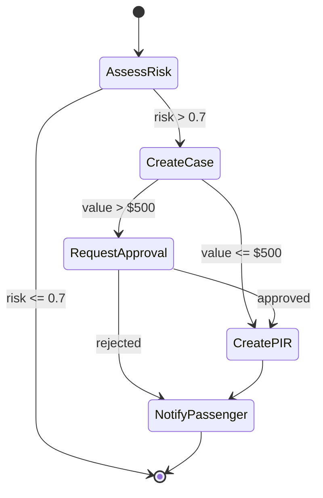

```mermaid
stateDiagram-v2
    [*] --> AssessRisk
    AssessRisk --> CreateCase: risk > 0.7
    AssessRisk --> [*]: risk <= 0.7
    CreateCase --> RequestApproval: value > $500
    CreateCase --> CreatePIR: value <= $500
    RequestApproval --> CreatePIR: approved
    RequestApproval --> NotifyPassenger: rejected
    CreatePIR --> NotifyPassenger
    NotifyPassenger --> [*]
```
