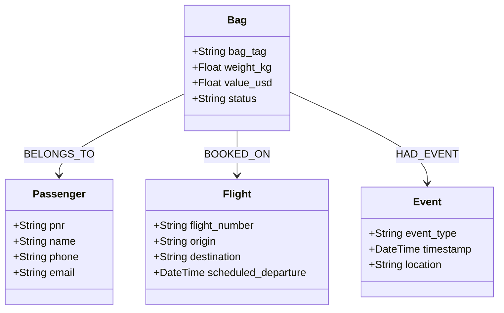

```mermaid
classDiagram
    class Bag {
        +String bag_tag
        +Float weight_kg
        +Float value_usd
        +String status
    }
    class Passenger {
        +String pnr
        +String name
        +String phone
        +String email
    }
    class Flight {
        +String flight_number
        +String origin
        +String destination
        +DateTime scheduled_departure
    }
    class Event {
        +String event_type
        +DateTime timestamp
        +String location
    }
    Bag --> Passenger : BELONGS_TO
    Bag --> Flight : BOOKED_ON
    Bag --> Event : HAD_EVENT
```
