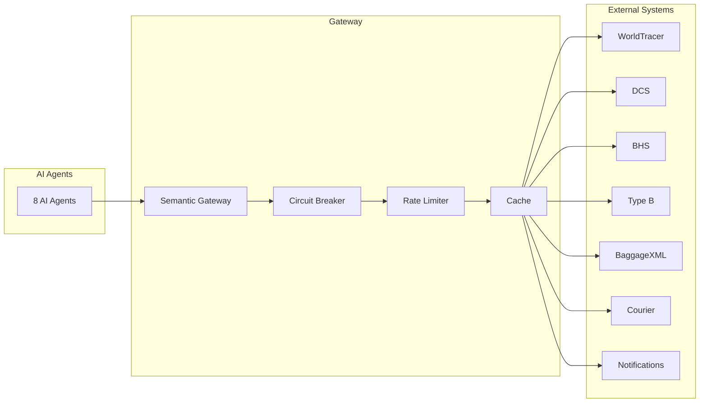

```mermaid
graph LR
    subgraph AI Agents
        AG[8 AI Agents]
    end
    subgraph Gateway
        SG[Semantic Gateway]
        CB[Circuit Breaker]
        RL[Rate Limiter]
        CA[Cache]
    end
    subgraph External Systems
        WT[WorldTracer]
        DCS[DCS]
        BHS[BHS]
        TB[Type B]
        XML[BaggageXML]
        CR[Courier]
        NT[Notifications]
    end
    AG --> SG
    SG --> CB
    CB --> RL
    RL --> CA
    CA --> WT
    CA --> DCS
    CA --> BHS
    CA --> TB
    CA --> XML
    CA --> CR
    CA --> NT
```
